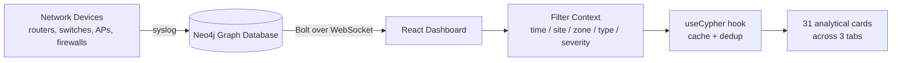

# Syslog Predictive Insights Platform

**An AI-Driven Approach to Proactive Monitoring**

A single-pane analytics dashboard that turns raw network syslog telemetry into operational
decisions — spotting failing hardware, security pressure, and unstable links *before* they
become outages.

---

## 1. Purpose

Network teams generate enormous volumes of syslog data that are typically only consulted
*after* an incident. This platform inverts that model: telemetry is continuously scored and
ranked so engineers can see which devices are degrading, which users and IPs are creating
risk, and where anomalies cluster geographically — all without writing a query.

**Business value**

| Outcome | How the dashboard delivers it |
|---|---|
| Reduce unplanned downtime | Composite device risk scoring surfaces at-risk hardware ahead of failure |
| Cut mean-time-to-detect | KPIs and heatmaps expose anomaly clusters at a glance |
| Improve security posture | Attacker IPs, risky users, policy hits, and privilege escalation in one view |
| Prioritise field work | Maintenance backlog and watchlists ranked by severity and site |
| Remove query dependency | Analysts explore graph data without knowing Cypher |

---

## 2. Architecture at a Glance

**Data model (Neo4j)**

- **Nodes:** `Event`, `Device`, `User`, `Resource`, `Policy`, `Alert`, `Incident`
- **Relationships:** `SOURCE_OF`, `TARGETED`, `PERFORMED`, `GOVERNED_BY`, `ACCESSED`, `RAISED`, `PART_OF`
- Events carry severity, timestamp, site, zone, protocol, port, country, metric name/value, and raw evidence

A graph database is the right fit here because the core questions are relational —
*"which devices sourced the events that triggered which policies for which users"* — which
would require expensive multi-way joins in a relational store.

---

## 3. What the Dashboard Shows

### Persistent KPI Strip
Four headline metrics, always visible, each clickable to reveal a Top-10 drill-down.

| KPI | Meaning | Colour |
|---|---|---|
| Total Events | Overall telemetry volume | Blue — informational |
| Critical Events | P1 severity count | Red — alarm |
| Denied / Blocked | Security controls enforced | Violet — control working |
| Devices At Risk | Hardware / reboot faults | Amber — act soon |

### Global Filter Bar
Every card responds to the same filter set: **time range** (7/30/90 days, all time),
**site**, **zone**, **device type**, and **severity**. One change re-scopes the entire view.

### Tab 1 — Network Anomalies
Operational stability and traffic health.

- Event volume by severity over time
- Interface flap leaderboard
- Routing adjacency failures by protocol
- Site-to-site VPN tunnel failures
- Wireless AP disconnects by controller
- Site × Zone anomaly heatmap
- Noisiest devices / silent devices (no telemetry ≥ 14 days)
- Failed communications by protocol

### Tab 2 — Security Events
Threat and access posture.

- Authentication outcome trend
- Top risky users and denial reason breakdown
- Top external attacker IPs, blocked ports, attack origin by country
- Most-triggered firewall and ACL policies
- Privilege escalation attempts (interactive audit log)
- SIEM anomaly signatures, DNS sinkhole hits
- Port-security violations by switch
- Configuration change audit

### Tab 3 — Predictive Maintenance
Hardware health and failure prediction — the core predictive value.

- **Device Risk Score Matrix** (see below)
- Health threshold breaches by metric
- Metric averages vs threshold limits
- Interface error degradation trend (predictive slope signal)
- Hardware faults by component; fault rate normalised by device type
- Unexpected reboot ranking and reboot cause distribution
- Thermal and fan outliers
- Optics / SFP degradation watchlist
- Maintenance backlog by site

---

## 4. The Risk Scoring Model

Each device receives a weighted composite score from its events in the selected window:

$$\text{score} = 10 \cdot \text{hwFaults} + 6 \cdot \text{unplannedReboots} + 4 \cdot \text{criticalHealth} + 1.5 \cdot \text{degradedHealth} + \frac{\text{interfaceErrors}}{5000}$$

Weights reflect operational severity — a hardware fault is a stronger failure predictor than
a degraded health reading. Planned maintenance reloads are explicitly excluded so scheduled
work does not inflate risk.

| Score | Tier | Action |
|---|---|---|
| ≥ 70 | **Critical** | Immediate intervention |
| 40 – 69 | **High** | Schedule this cycle |
| 20 – 39 | **Medium** | Monitor closely |
| 0 – 19 | **Low** | Normal operation |

The top 25 devices by score are shown, each with a drill-down into its full event history.

---

## 5. Technology

| Layer | Choice |
|---|---|
| UI | React 19 + TypeScript |
| Build | Vite 6 |
| Styling | Tailwind CSS 4 |
| Charts | Recharts 3 |
| Tables | TanStack Table 8 |
| Data | Neo4j 6 driver (Bolt over WebSocket) |
| Graph views | React Flow (routing topology) |

**Engineering notes**

- All ~31 cards share one query hook with response caching and in-flight deduplication, so a
  filter change does not produce duplicate round-trips.
- Every card handles its own loading, error, retry, and empty ("no signal") state independently.
- Any card's underlying data can be exported to CSV.
- Device names are clickable throughout, opening a unified device detail drawer.

---

## 6. Current Status & Next Steps

**Working today:** live connection to the Neo4j instance, all three tabs populated with real
telemetry, global filtering, drill-downs, and CSV export.

**Recommended before wider rollout**

1. **Move credentials server-side.** Database credentials are currently bundled into the
   browser build, which exposes them to any user of the page. A thin API layer would resolve this.
2. **Normalise risk scores by time window.** Scores are raw event sums, so widening the date
   range inflates every device proportionally. Scoring per-day (or by percentile) would make
   tiers comparable across ranges.
3. **Increase health telemetry sampling.** Some metrics currently average only 1–2 readings per
   device per window, which limits trend confidence for thermal and fan analysis.
4. **Validate weights against real failure history** to tune the risk model empirically.

---

*Document generated for internal review.*
